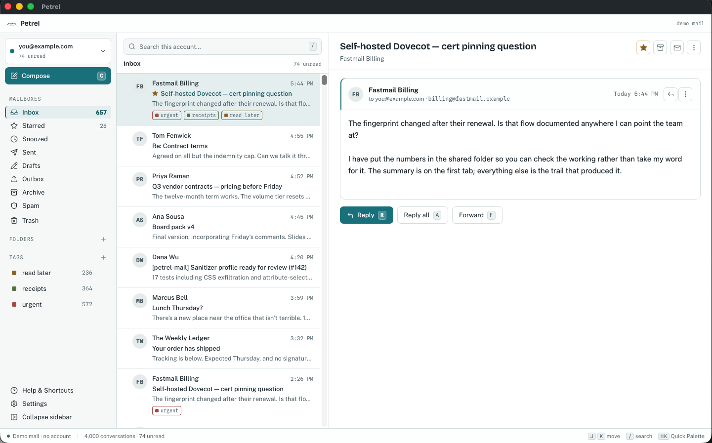

<div align="center">


# Petrel

**A fast, local-first desktop email client.**

[](https://github.com/donth77/petrel-mail/releases)
[](LICENSE)
[](rust-toolchain.toml)
[](https://tauri.app)
[](https://react.dev)




</div>

---

Petrel talks straight to your mail server. No middleman service, no database you can't read.

**Fast.** Opens a 100,000-message mailbox in ~50ms. Search comes back in ~45ms.

**Open.** IMAP and SMTP. Gmail and Microsoft 365 native APIs next, JMAP after that.

**Private.** Your mail goes between your machine and your provider. Remote images off
by default.

**Durable.** SQLite and ordinary files. Export any folder to mbox.

---

## What works

**Mail**
- IMAP and SMTP, multiple accounts
- Autodiscovery for 16 providers
- Gmail and iCloud
- Conversation threading
- Instant arrival, no polling

**Reading**
- HTML sandboxed. No scripts, no network.
- Remote images and trackers blocked
- Attachments and inline images
- Dark mode 
- Meeting invites 

**Writing**
- Rich text editor
- Signatures
- Drafts, local and server
- Undo send
- Missing-attachment warning

**Organizing**
- Search: `from:alice has:attachment before:2026-01-01`
- Archive, move, star, delete. 
- Tags sync as Gmail labels or IMAP keywords
- Rules
- Trash auto-empty: 7, 30, 90 days, or never

<details>
<summary><strong>And the rest</strong></summary>

- Keyboard shortcuts, ⌘K palette
- Notifications, with pause
- mbox and `.eml` import, mbox export
- Signed updates
- Keyboard and screen reader accessible
- QRESYNC and CONDSTORE where the server has them

</details>

---

## Install

> **No release is published yet.** 1.0 is being finished. Until it is cut, build from
> source with the steps under [Build](#build).

When there is one, download the `.dmg` from the
[Releases tab](https://github.com/donth77/petrel-mail/releases), open it, and drag
Petrel to your Applications folder. It is signed and notarized by Apple, so it opens
without a warning.

The `.app.tar.gz` and `latest.json` on a release are for the built-in updater. You do
not need them.

---

## Build

Rust engine for protocols, storage, search and sanitizing. Tauri 2 shell around a
React UI. The engine runs fine without a window.

Needs **Rust 1.96+** and **Node 22+ with pnpm**.

```sh
pnpm install

# Run it
pnpm --dir apps/desktop/ui build
cargo petrel

# Or build a .app bundle (macOS)
./scripts/rebuild.sh
```

> `cargo petrel` is an alias for `cargo run --release -p petrel-desktop --features
> custom-protocol`. That feature puts Tauri in production mode. Leave it out and the
> webview goes looking for the Vite dev server, and you get a blank window.

### Layout

```
crates/petrel-engine       storage, search, actions, the engine API
crates/petrel-providers    provider backends (IMAP/SMTP; Gmail API; Microsoft Graph)
crates/petrel-mime         parsing, sanitization profile, message building
crates/petrel-autoconfig   account autodiscovery
crates/petrel-testkit      synthetic mailboxes, fault injection, corpora
apps/desktop               Tauri shell + UI
```

<details>
<summary><strong>Tests</strong></summary>

```sh
cargo test --workspace
cargo clippy --workspace --all-targets \
  --features petrel-desktop/custom-protocol -- -D warnings
pnpm --dir apps/desktop/ui exec vitest run

# Storage and search benchmark, 100k synthetic messages
cargo test --release -p petrel-engine --test store_spike -- --ignored --nocapture
```

Integration tests can point at a throwaway GreenMail server; see `testkit/`. Don't aim
them at a mailbox you care about. They interrupt sends and kill the process mid-write
on purpose.

</details>

## Security

Your mail and your passwords are the two things worth attacking here. If you
find a way at either, please report it privately rather than opening an issue:
[SECURITY.md](SECURITY.md) explains how, what is in scope, and what stands
between a stranger's message and your mail.
